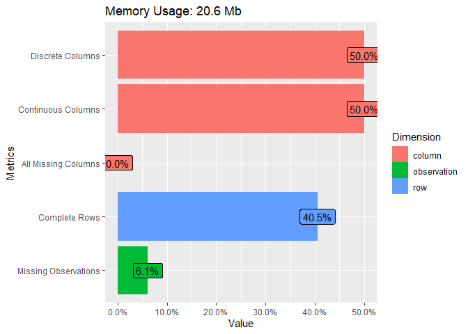
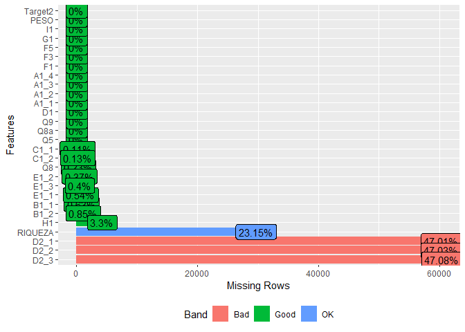
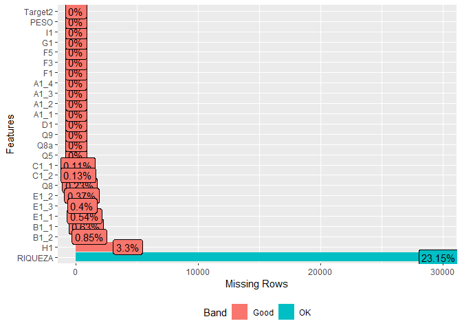
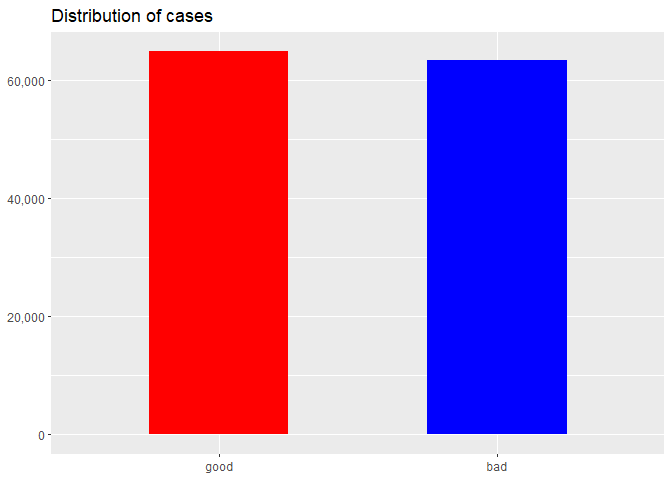
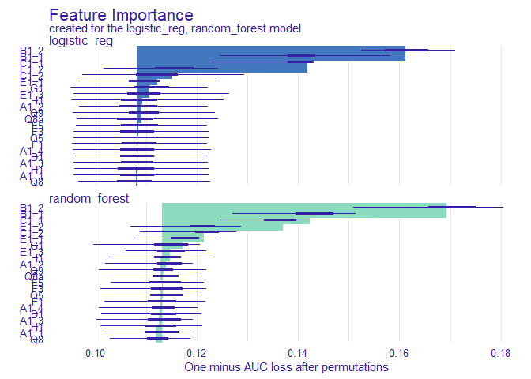
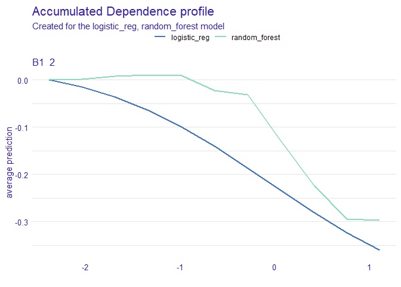
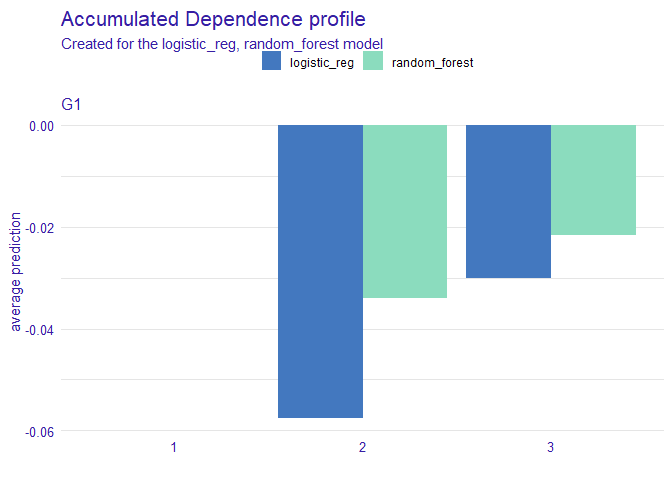
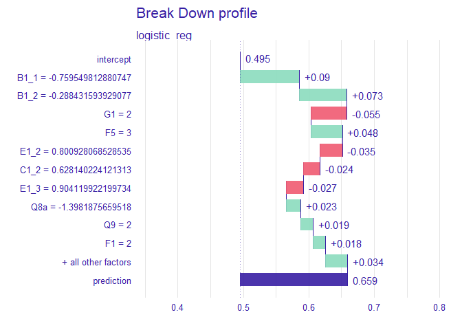
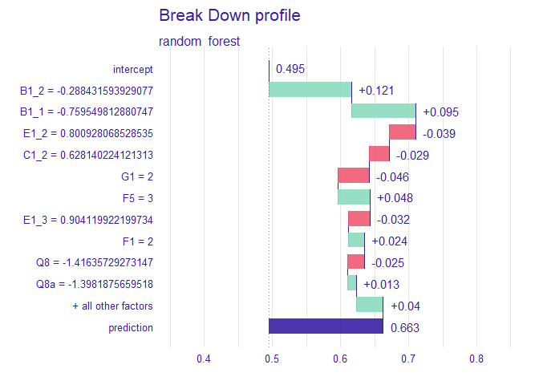

# Goal

Read data from Brazil’s cell phone companies and predict customer
satisfaction

``` r
library(reticulate)
use_miniconda("r-reticulate",required = TRUE)
options(reticulate.repl.quiet = TRUE)
```

``` r
file_path <- here::here()
file_path_linux <- paste(file_path,"content","post","data",sep = "/")
```

# Python

## Import libraries

``` python
import pandas as pd
import numpy as np
```

## Read feather data frame

``` python
df1 = pd.read_feather(r.file_path_linux + "/BD_PRE.feather")
```

## Describe the dataframe

``` python
df1.describe()
```

    ##               IDTNS       ANO_BASE  ...           PESO            I2
    ## count  1.284110e+05  128411.000000  ...  128411.000000  84441.000000
    ## mean   2.062114e+07    2016.269774  ...       0.999992      1.179806
    ## std    2.192746e+07       1.120365  ...       1.315625      0.384028
    ## min    3.780000e+02    2015.000000  ...       0.015936      1.000000
    ## 25%    6.160118e+06    2015.000000  ...       0.180556      1.000000
    ## 50%    6.804225e+06    2016.000000  ...       0.601990      1.000000
    ## 75%    4.105798e+07    2017.000000  ...       1.348837      1.000000
    ## max    6.203986e+07    2018.000000  ...      10.965368      2.000000
    ## 
    ## [8 rows x 47 columns]

## Drop features

My group read the data dictionary and glanced at the data to decido to
drop of multipe features with for low variance or too high cardinality

``` python
df1=df1.drop(["IDTNS","TIPO","DATA","H0","Q1","Q2","Q3","Q4","Q6","Q7"],axis=1)

df1.head()
```

    ##   OPERADORA ESTADO  ANO_BASE  Q5  Q8  ...      H2  H2a  I1      PESO   I2
    ## 0        OI     RJ      2018   1  44  ...  999998    1   2  1.165414  2.0
    ## 1        OI     BA      2018   1  50  ...  999998    6   1  1.911877  1.0
    ## 2      VIVO     ES      2018   1  37  ...    1000    1   1  0.695489  1.0
    ## 3     CLARO     RR      2018   1  19  ...  999998    2   1  0.054054  1.0
    ## 4        OI     ES      2018   1  39  ...  999998    7   1  0.111111  1.0
    ## 
    ## [5 rows x 42 columns]

## Rename target

``` python
df1 = df1.rename(columns = {'J1':'Target'})
```

## NA enconding

The dictionary defined 99 as missing in multiple features

``` python
df2 =  df1.copy()
```

``` python
df2['B1_1'].replace([99], np.NaN,inplace = True)
df2['B1_2'].replace([99], np.NaN,inplace = True)
df2['C1_1'].replace([99], np.NaN,inplace = True)
df2['C1_2'].replace([99], np.NaN,inplace = True)
df2['D2_1'].replace([99], np.NaN,inplace = True)
df2['D2_2'].replace([99], np.NaN,inplace = True)
df2['D2_3'].replace([99], np.NaN,inplace = True)
df2['F5'].replace([99], np.NaN,inplace = True)
df2['F4'].replace([99], np.NaN,inplace = True)
df2['F2'].replace([99], np.NaN,inplace = True)
df2['A5'].replace([99], np.NaN,inplace = True)
df2['A4'].replace([99], np.NaN,inplace = True)
df2['A3'].replace([99], np.NaN,inplace = True)
df2['A2_1'].replace([99], np.NaN,inplace = True)
df2['A2_2'].replace([99], np.NaN,inplace = True)
df2['A2_3'].replace([99], np.NaN,inplace = True)
df2['E1_1'].replace([99], np.NaN,inplace = True)
df2['E1_2'].replace([99], np.NaN,inplace = True)
df2['E1_3'].replace([99], np.NaN,inplace = True)
df2['F4'].replace([99], np.NaN,inplace = True)
df2['F5'].replace([99], np.NaN,inplace = True)
df2['F6'].replace([99], np.NaN,inplace = True)
```

Sometimes variations of missing like didn’t want to answer were also
enconded as numbers so we encoded those ase missing as well

``` python
df2['Q8'].replace([999999], np.NaN,inplace = True)
df2['H1'].replace([99,99999], np.NaN,inplace = True)
df2['H2'].replace([99997,99998,99999,100000,999998,999999], np.NaN,inplace = True)
```

## Feature Engeniring

Droped H2a for now in order to code it as categories

``` python
df2.drop(["H2a"],inplace = True,axis = 1)
```

``` python
df3 = df2.copy()
```

``` python
df3.loc[(df3["H2"] >=0) & (df3["H2"] <1000), "RIQUEZA"]=1
df3.loc[(df3["H2"] >=1000) & (df3["H2"] <3000), "RIQUEZA"]=2
df3.loc[(df3["H2"] >=3000) & (df3["H2"] <6000), "RIQUEZA"]=3
df3.loc[(df3["H2"] >=6000) & (df3["H2"] <10000), "RIQUEZA"]=4
df3.loc[(df3["H2"] >=10000) & (df3["H2"] <15000), "RIQUEZA"]=5
df3.loc[(df3["H2"] >=15000) & (df3["H2"] <20000), "RIQUEZA"]=6
df3.loc[(df3["H2"] >=20000), "RIQUEZA"]=7
```

``` python
df3.RIQUEZA.value_counts(dropna =False)
```

    ## 2.0    48387
    ## 1.0    33554
    ## NaN    29784
    ## 3.0    12543
    ## 4.0     2704
    ## 5.0      850
    ## 7.0      315
    ## 6.0      274
    ## Name: RIQUEZA, dtype: int64

## Target Variable

We decided with an nps system that scores above 8 were good scores, and
encoded these cases as 1 and the rest as 0.

``` python
df3['Target'].replace([99], np.NaN,inplace = True)

df3.loc[(df3["Target"] <8) ,"Target2"]= 0
df3.loc[(df3["Target"] >=8 ) ,"Target2"]= 1


df3.dropna(subset=['Target'],inplace = True)
```

Variaveis Categoricas Moda Estado  
Operadora  
RIQUEZA  
Q9  
I1 D1  
Q5  
F1 F3  
F5  
G1

Variaveis Categoricas Missing Explicito A1_x

## NA imputing

We decided that these numeric features would be imputted with 0s a more
robust approach could be taken but the main idea was for to create a
simple model

``` python
df3["A1_1"].fillna(0,inplace = True)
df3["A1_2"].fillna(0,inplace = True)
df3["A1_3"].fillna(0,inplace = True)
df3["A1_4"].fillna(0,inplace = True)
df3["F1"].fillna(0,inplace = True)
df3["F3"].fillna(0,inplace = True)
df3["F5"].fillna(0,inplace = True)
```

## Feature encoding

We originally hand encoded all the features in python, this would help
to automate the predictions latter down the pipe unfortunally when
replicating the code it seems I have a bug on reticulate so I will do
that in r instead

``` python
# df3 = df3.astype({'Q9': 'category'})
# df3 = df3.astype({'I1': 'category'})
# df3 = df3.astype({'D1': 'category'})
# df3 = df3.astype({'Q5': 'category'})
# df3 = df3.astype({'F1': 'category'})
# df3 = df3.astype({'F3': 'category'})
# df3 = df3.astype({'F5': 'category'})
# df3 = df3.astype({'G1': 'category'})
# df3 = df3.astype({'A1_1': 'category'})
# df3 = df3.astype({'A1_2': 'category'})
# df3 = df3.astype({'A1_3': 'category'})
# df3 = df3.astype({'A1_4': 'category'})
# df3 = df3.astype({'RIQUEZA': 'category'})
# df3 = df3.astype({'Target2': 'category'})
```

``` python
df3.dtypes
```

    ## OPERADORA     object
    ## ESTADO        object
    ## ANO_BASE       int64
    ## Q5             int64
    ## Q8           float64
    ## Q8a            int64
    ## Q9             int64
    ## Target       float64
    ## B1_1         float64
    ## B1_2         float64
    ## C1_1         float64
    ## C1_2         float64
    ## D1             int64
    ## D2_1         float64
    ## D2_2         float64
    ## D2_3         float64
    ## E1_1         float64
    ## E1_2         float64
    ## E1_3         float64
    ## A1_1         float64
    ## A1_2         float64
    ## A1_3         float64
    ## A1_4         float64
    ## A2_1         float64
    ## A2_2         float64
    ## A2_3         float64
    ## A3           float64
    ## A4           float64
    ## A5           float64
    ## F1             int64
    ## F2           float64
    ## F3             int64
    ## F4           float64
    ## F5           float64
    ## F6           float64
    ## G1             int64
    ## H1           float64
    ## H2           float64
    ## I1             int64
    ## PESO         float64
    ## I2           float64
    ## RIQUEZA      float64
    ## Target2      float64
    ## dtype: object

## Prepare df to export to r

``` python
df4=df3.loc[:,['Q5','Q8','Q8a','Q9','B1_1','B1_2','C1_1','C1_2','D1','D2_1','D2_2','D2_3','E1_1','E1_2','E1_3','A1_1','A1_2','A1_3','A1_4','F1','F3','F5','G1','H1','I1','PESO','RIQUEZA',"Target2"]]
```

# R

## Import df from python

``` r
df_r <- py$df4
```

## Import libraries

``` r
library(DataExplorer)
library(tidyverse)
library(tidymodels)
library(furrr)
library(h2o)
library(DALEX)
library(DALEXtra)
library(iBreakDown)
library(ingredients)
library(probably)
```

## Encode types

``` r
df_r %>% glimpse()
```

    ## Rows: 128,198
    ## Columns: 28
    ## $ Q5      <dbl> 1, 1, 1, 1, 1, 1, 1, 2, 1, 1, 1, 1, 1, 1, 1, 2, 1, 1, 1, 1, 1, 1, 1, 1, 1, 1, 1, 1, 1, 1, 1, 1, 1, 1, 1, 2, 1, 1, 1, 1, 1, 1, 1, 1, 2, 1, 1, 1, 1, 1, 1, 1, 1, 1, ~
    ## $ Q8      <dbl> 44, 50, 37, 19, 39, 38, NaN, 19, 22, 27, 24, 47, 29, 21, 40, 18, 25, 70, 43, 38, 27, 22, 37, 20, 50, 47, 47, 36, 48, 47, 30, 25, 22, 30, 43, 25, 23, 24, 36, 19, 4~
    ## $ Q8a     <dbl> 7, 7, 6, 3, 6, 6, 7, 3, 3, 4, 3, 7, 4, 3, 6, 3, 4, 8, 7, 6, 4, 3, 6, 3, 7, 7, 7, 6, 7, 7, 4, 4, 3, 4, 7, 4, 3, 3, 6, 3, 7, 4, 6, 3, 4, 4, 3, 7, 7, 7, 7, 4, 7, 8, ~
    ## $ Q9      <dbl> 1, 2, 1, 2, 1, 2, 1, 1, 2, 2, 1, 2, 2, 1, 1, 1, 1, 1, 2, 2, 2, 1, 2, 1, 1, 1, 2, 2, 2, 2, 2, 2, 1, 2, 2, 2, 1, 1, 1, 2, 2, 2, 2, 2, 1, 1, 2, 2, 1, 1, 1, 2, 2, 1, ~
    ## $ B1_1    <dbl> 7, 4, 9, 5, 10, 10, 8, 8, 10, 4, 0, 8, 5, 5, 10, 5, 7, 10, 10, 7, 10, 8, 5, 6, 0, 5, 9, 10, 10, 6, 2, 3, 10, 10, 0, 10, 7, 0, 8, 8, 5, 8, 0, 9, 4, 6, 8, 7, 6, 9, ~
    ## $ B1_2    <dbl> 9, 3, 10, 6, NaN, 10, 8, 6, 9, 6, 5, 8, 5, 3, 10, 10, 5, 10, 10, 7, 10, 10, 8, 3, 8, 5, 2, 10, 10, 7, 1, 0, 9, 10, 0, 8, 5, 0, 8, 10, 4, 8, 0, 8, 5, 5, 7, 10, 6, ~
    ## $ C1_1    <dbl> 10, 3, 10, 8, 10, 8, 7, 10, 10, 8, 7, 10, 10, 8, 10, 2, 7, 10, 10, 8, 10, 8, 7, 9, 10, 5, 7, 10, 10, 5, 3, 0, 10, 10, 7, 10, 0, 10, 9, 10, 5, 9, 5, 4, 8, 10, 7, 1~
    ## $ C1_2    <dbl> 10, 4, 10, 9, 10, 9, 6, 10, 5, 9, 0, 8, 10, 2, 10, 9, 8, 10, 8, 6, 10, 8, 7, 9, 10, 5, 8, 7, 10, 5, 3, 0, 10, 10, 7, 9, 0, 10, 9, 10, 8, 9, 0, 6, 7, 7, 8, 10, 8, ~
    ## $ D1      <dbl> 1, 2, 1, 1, 1, 1, 2, 1, 1, 1, 2, 1, 2, 1, 1, 1, 2, 2, 2, 1, 2, 1, 1, 1, 2, 2, 1, 1, 2, 1, 1, 1, 1, 1, 2, 1, 1, 2, 1, 1, 1, 2, 1, 1, 1, 1, 1, 1, 1, 2, 2, 1, 2, 1, ~
    ## $ D2_1    <dbl> 8, NaN, 9, 4, 7, 10, NaN, 1, 10, 5, NaN, 6, NaN, 2, 8, 9, NaN, NaN, NaN, 6, NaN, 8, 7, 6, NaN, NaN, 0, 7, NaN, 8, 0, 0, 8, 0, NaN, 10, 3, NaN, 8, 10, 6, NaN, 3, 9~
    ## $ D2_2    <dbl> 7, NaN, 7, 3, 5, 10, NaN, 1, 9, 7, NaN, 8, NaN, 0, 8, 7, NaN, NaN, NaN, 7, NaN, 9, 6, 7, NaN, NaN, 0, 7, NaN, 7, 0, 2, 8, 10, NaN, 9, 2, NaN, 4, 5, 6, NaN, 0, 10,~
    ## $ D2_3    <dbl> 7, NaN, 7, 5, 5, 10, NaN, 1, 10, 6, NaN, 6, NaN, 0, 8, 8, NaN, NaN, NaN, 8, NaN, 9, 7, 6, NaN, NaN, 0, 10, NaN, 8, 1, 0, 8, 10, NaN, 9, 4, NaN, 6, 10, 6, NaN, 0, ~
    ## $ E1_1    <dbl> 8, 2, 9, 7, 8, 10, 7, 3, 9, 8, 0, 5, 7, 0, 10, 7, 7, 10, 10, 9, NaN, 9, 8, 6, 7, 5, 10, 8, 10, 8, 0, 6, 8, 10, 3, 10, 2, 10, 9, 10, 5, 9, 0, 8, NaN, 7, 7, 10, 7, ~
    ## $ E1_2    <dbl> 8, 2, 9, 9, 10, 10, 7, 8, 9, 5, 0, 6, 5, 0, 10, 6, 7, 10, 10, 3, NaN, 7, 8, 3, 5, 5, 8, 10, 10, 9, 0, 0, 9, 10, 7, 10, 0, 10, 8, 10, 4, 9, 0, 10, 2, 6, 8, 7, 5, 9~
    ## $ E1_3    <dbl> 10, 5, 9, 10, 8, 10, 8, 10, 10, 8, 0, 8, 5, 5, 10, 6, 8, 10, 10, 9, NaN, 8, 8, 6, 9, 5, 8, 10, 10, 8, 1, 5, 10, 10, 3, 10, 2, 5, 7, 10, 4, 9, 8, 7, 8, 10, 8, 10, ~
    ## $ A1_1    <dbl> 0, 0, 1, 1, 0, 1, 1, 0, 1, 0, 0, 0, 0, 1, 1, 0, 1, 1, 0, 1, 0, 0, 1, 1, 0, 0, 1, 0, 1, 1, 1, 0, 0, 1, 1, 0, 1, 1, 1, 0, 1, 0, 1, 0, 0, 1, 1, 1, 0, 0, 0, 0, 0, 1, ~
    ## $ A1_2    <dbl> 0, 2, 0, 0, 0, 0, 0, 0, 2, 2, 0, 0, 0, 2, 2, 2, 0, 0, 0, 0, 0, 0, 2, 2, 0, 0, 0, 0, 2, 0, 2, 0, 0, 2, 0, 0, 2, 0, 2, 0, 2, 0, 0, 2, 2, 2, 0, 0, 0, 0, 0, 0, 0, 0, ~
    ## $ A1_3    <dbl> 0, 0, 0, 0, 0, 0, 0, 0, 0, 0, 0, 0, 0, 0, 0, 0, 0, 3, 0, 0, 0, 0, 0, 0, 0, 0, 0, 3, 0, 0, 0, 3, 0, 3, 0, 0, 0, 0, 0, 0, 3, 0, 0, 0, 0, 0, 0, 0, 0, 0, 0, 0, 0, 0, ~
    ## $ A1_4    <dbl> 97, 0, 0, 0, 97, 0, 0, 97, 0, 0, 97, 97, 97, 0, 0, 0, 0, 0, 97, 0, 97, 97, 0, 0, 97, 97, 0, 0, 0, 0, 0, 0, 97, 0, 0, 97, 0, 0, 0, 97, 0, 97, 0, 0, 0, 0, 0, 0, 97,~
    ## $ F1      <dbl> 2, 2, 2, 1, 2, 1, 2, 2, 2, 2, 2, 2, 2, 2, 2, 2, 1, 2, 2, 1, 2, 2, 2, 2, 2, 2, 2, 2, 2, 2, 1, 2, 2, 1, 2, 2, 1, 1, 1, 1, 2, 2, 2, 2, 1, 2, 2, 1, 2, 2, 2, 2, 2, 1, ~
    ## $ F3      <dbl> 2, 2, 2, 2, 2, 2, 2, 2, 2, 2, 2, 2, 2, 1, 2, 2, 2, 1, 2, 2, 2, 2, 1, 2, 2, 2, 2, 2, 2, 1, 1, 1, 2, 2, 2, 2, 1, 1, 2, 1, 2, 2, 2, 2, 2, 2, 2, 2, 2, 1, 2, 2, 2, 1, ~
    ## $ F5      <dbl> 2, 0, 2, 1, 2, 2, 0, 1, 2, 1, 0, 2, 0, 2, 1, 2, 0, 0, 0, 2, 0, 2, 2, 2, 0, 0, 1, 2, 0, 2, 1, 1, 2, 1, 0, 2, 1, 0, 2, 2, 2, 0, 2, 2, 2, 2, 1, 2, 2, 0, 0, 2, 0, 2, ~
    ## $ G1      <dbl> 1, 1, 2, 2, 1, 2, 3, 1, 2, 1, 2, 1, 1, 1, 1, 1, 1, 1, 1, 1, 1, 1, 1, 1, 3, 1, 1, 1, 1, 1, 1, 1, 2, 1, 1, 2, 1, 1, 1, 1, 1, 1, 1, 1, 1, 2, 1, 1, 1, 2, 1, 1, 1, 1, ~
    ## $ H1      <dbl> 3, NaN, 1, 3, 1, 5, 1, 2, 2, 1, 1, 1, 1, 4, 2, 2, 1, 2, 2, 2, 2, 2, 2, 2, 1, 2, 2, 1, 2, 2, 1, 2, 2, 1, 2, 2, 2, 2, 2, 3, 2, 2, 2, 3, 2, 1, 4, 1, 2, 1, 1, 1, 2, 2~
    ## $ I1      <dbl> 2, 1, 1, 1, 1, 1, 2, 2, 2, 1, 1, 1, 1, 1, 1, 1, 2, 1, 2, 2, 1, 2, 1, 1, 1, 2, 1, 2, 1, 1, 2, 2, 2, 1, 1, 1, 1, 1, 2, 1, 1, 1, 1, 1, 2, 2, 1, 2, 2, 2, 1, 1, 1, 1, ~
    ## $ PESO    <dbl> 1.1654135, 1.9118774, 0.6954887, 0.0540541, 0.1111111, 0.1111111, 2.3084577, 1.6571429, 0.5905172, 0.5049505, 0.8144330, 5.0432692, 0.5810277, 2.4054054, 2.985576~
    ## $ RIQUEZA <dbl> NaN, NaN, 2, NaN, NaN, 1, NaN, NaN, 2, 2, 1, NaN, 2, NaN, 2, 2, NaN, NaN, 2, 4, NaN, 2, 4, 2, NaN, NaN, NaN, 2, NaN, NaN, 3, NaN, 1, NaN, NaN, 2, NaN, 2, 2, 2, 1,~
    ## $ Target2 <dbl> 1, 0, 1, 0, 1, 1, 1, 0, 1, 0, 0, 1, 0, 0, 1, 1, 0, 1, 1, 1, 1, 0, 0, 1, 1, 0, 0, 1, 1, 1, 0, 0, 1, 1, 0, 1, 0, 0, 1, 1, 0, 1, 0, 1, 1, 0, 0, 1, 0, 1, 1, 1, 1, 1, ~

``` r
category_pipe <- . %>% 
  as.character() %>% 
  if_else(. == "NaN",NA_character_,.) %>% 
  as_factor()
```

``` r
df_r <- df_r %>% 
  mutate_at(vars(Q9,I1,D1,Q5,F1,F3,F5,G1,starts_with("A1"),RIQUEZA,Target2),.funs = category_pipe)
```

## Explore in r with data explorer

``` r
DataExplorer::introduce(df_r)
```

    ##     rows columns discrete_columns continuous_columns all_missing_columns total_missing_values complete_rows total_observations memory_usage
    ## 1 128198      28               14                 14                   0               218989         51924            3589544     21551024

``` r
DataExplorer::plot_intro(df_r)
```



``` r
plot_missing(df_r)
```

 \#\# Drop
features

``` r
df_r <- df_r %>% 
  select(-starts_with("D2"))
```

``` r
plot_missing(df_r)
```

 \#\#
Encode response in r

``` r
  df_r <- df_r %>% 
  rename(response = Target2) %>% 
  select(-PESO)
```

## More exploration

``` r
df_r %>%
  mutate(response = response %>% fct_recode(bad = "0",good ="1")) %>% 
  count(response) %>%
  ggplot(aes(response, n, fill = response)) + 
  geom_col(width = .5, show.legend = FALSE) + 
  scale_y_continuous(labels = scales::comma) +
  scale_fill_manual(values = c("red","blue")) +
  labs(
    x = NULL,
    y = NULL,
    title = "Distribution of cases"
  )
```

 \#
Modeling

## Train test split

``` r
telefone_initial_split <- df_r %>% rsample::initial_split(prop = 0.9)
telefone_initial_split
```

    ## <Analysis/Assess/Total>
    ## <115379/12819/128198>

``` r
train_data <- training(telefone_initial_split)
test_data <- testing(telefone_initial_split)
```

## Recipe for models

``` r
recipe_telefone <- 
  recipe(response ~.,data = train_data) %>%
  #step_upsample(response,skip = TRUE) %>% 
  step_modeimpute(all_predictors(),-all_numeric()) %>% 
  step_medianimpute(all_predictors(),-all_nominal()) %>% 
  step_normalize(all_numeric()) %>% 
  step_rm(RIQUEZA)
  #step_dummy(all_predictors(),-all_numeric())
```

## Prep Data

``` r
simple_model_recipe <- recipe_telefone %>%
  prep(retain = TRUE)

simple_train <- simple_model_recipe %>% juice()

simple_test <- simple_model_recipe %>% bake(test_data)
```

## Logistic Regression

``` r
logistic_regression <- 
  logistic_reg(mode = "classification",penalty = 0) %>%
  set_engine("glmnet") %>% 
  fit(response ~.,data = simple_train)

metrics_log_reg <- logistic_regression %>% 
  predict(simple_test) %>% 
  bind_cols(simple_test %>% select(response)) %>% 
  metrics(truth = response,estimate = .pred_class)

metrics_roc_auc <- logistic_regression %>% 
  predict(simple_test,type = "prob") %>% 
  bind_cols(simple_test %>% select(response)) %>% 
  roc_auc(truth = response,predictor =.pred_0)
```

### Metrics Logistic

``` r
metrics_log_reg
```

    ## # A tibble: 2 x 3
    ##   .metric  .estimator .estimate
    ##   <chr>    <chr>          <dbl>
    ## 1 accuracy binary         0.805
    ## 2 kap      binary         0.610

``` r
metrics_roc_auc
```

    ## # A tibble: 1 x 3
    ##   .metric .estimator .estimate
    ##   <chr>   <chr>          <dbl>
    ## 1 roc_auc binary         0.114

I am going to keep using roc from now on \#\# Lasso

``` r
lasso_regression <- logistic_reg(mode = "classification",mixture = 0) %>% 
  set_engine("glmnet") %>% 
  fit(response~ .,data = simple_train)

lasso_roc_auc_cv <- lasso_regression %>% 
  multi_predict(new_data = simple_test,type = "prob") %>% 
  bind_cols(simple_test) %>%
  unnest() %>% 
  group_by(penalty) %>% 
  do(ok = roc_auc(.,truth = response,predictor = .pred_0)) %>% 
  unnest() %>%
  spread(key = .metric,value = .estimate) %>%
  arrange(roc_auc %>% desc)
```

    ## Warning: `cols` is now required when using unnest().
    ## Please use `cols = c(.pred)`

    ## Warning: `cols` is now required when using unnest().
    ## Please use `cols = c(ok)`

### Metrics Lasso

``` r
lasso_roc_auc_cv
```

    ## # A tibble: 100 x 3
    ##    penalty .estimator roc_auc
    ##      <dbl> <chr>        <dbl>
    ##  1    272. binary       0.5  
    ##  2    248. binary       0.121
    ##  3    226. binary       0.121
    ##  4    206. binary       0.121
    ##  5    188. binary       0.121
    ##  6    171. binary       0.121
    ##  7    156. binary       0.121
    ##  8    142. binary       0.121
    ##  9    129. binary       0.121
    ## 10    118. binary       0.121
    ## # ... with 90 more rows

## Ridge

``` r
ridge_regression <- logistic_reg(mode = "classification",mixture = 1) %>% 
  set_engine("glmnet") %>% 
  fit(response~ .,data = simple_train)

ridge_results_cv <- ridge_regression %>% 
  multi_predict(new_data = simple_test,type = "prob") %>% 
  bind_cols(simple_test) %>%
  unnest() %>% 
  group_by(penalty) %>% 
  do(ok = roc_auc(.,truth = response,predictor = .pred_0)) %>% 
  unnest() %>%
  spread(key = .metric,value = .estimate) %>%
  arrange(roc_auc %>% desc)
```

    ## Warning: `cols` is now required when using unnest().
    ## Please use `cols = c(.pred)`

    ## Warning: `cols` is now required when using unnest().
    ## Please use `cols = c(ok)`

### Metrics Ridge

``` r
ridge_results_cv
```

    ## # A tibble: 65 x 3
    ##    penalty .estimator roc_auc
    ##      <dbl> <chr>        <dbl>
    ##  1   0.272 binary       0.5  
    ##  2   0.248 binary       0.165
    ##  3   0.226 binary       0.150
    ##  4   0.206 binary       0.147
    ##  5   0.188 binary       0.145
    ##  6   0.171 binary       0.136
    ##  7   0.156 binary       0.130
    ##  8   0.142 binary       0.126
    ##  9   0.129 binary       0.123
    ## 10   0.118 binary       0.122
    ## # ... with 55 more rows

## Random Forest

``` r
  random_forest <- rand_forest(mode = "classification",trees = 100) %>% 
  set_engine("ranger") %>% 
  fit(response~ .,data = simple_train)
```

### Metrics Random forest

The best model currently

``` r
random_forest %>% 
  predict(simple_test,type = "prob") %>% 
  bind_cols(simple_test %>% select(response)) %>% 
  roc_auc(truth = response,predictor =.pred_0)
```

    ## # A tibble: 1 x 3
    ##   .metric .estimator .estimate
    ##   <chr>   <chr>          <dbl>
    ## 1 roc_auc binary         0.110

## h2o

h2o is usually very fast but not fast enough for this blogpost but here
is the code for it

### Start CLuster

### Upload df’s

``` r
# simple_train_hex <-  as.h2o(simple_train)
# simple_test_hex = as.h2o(simple_test)
# simple_y_hex <- simple_train %>% select(response) %>% pull %>% as.numeric()
# simple_x_hex <- simple_train %>% select(-response)
```

### Fit auto ml

With a 2 minutes timer

``` r
# h2o.no_progress()
# 
# aml <- h2o.automl(y = "response",
#                   training_frame = simple_train_hex,
#                   max_runtime_secs = 120,
#                   seed = 1)
# 
```

### Model results

``` r
# pred <- h2o.predict(aml, simple_test_hex)
```

``` r
# aml@leaderboard
```

``` r
# model_ids <- as.data.frame(aml@leaderboard$model_id)[,1]
# model_ids
```

### Using a stacked model

``` r
# best_h2o <- h2o.getModel(model_ids[model_ids %>% str_detect("StackedEnsemble_BestOfFamily_AutoML")])
```

### Performance

``` r
# result_predictions <- predict(best_h2o,simple_test_hex)
```

``` r
# result_predictions %>% 
#   as_tibble() %>% 
#   bind_cols(simple_test) %>% 
#   roc_auc(truth = response,predictor = p0)
```

# DALEX - Are machinge learning models Black Boxes?

Code based from [Dalex page](https://github.com/ModelOriented/DALEX)

## Dalex X e Y

``` r
x_dalex <- simple_test %>% select(-response)
y_dalex <- simple_test %>%
  transmute(response = response %>%
              as.numeric()) %>% 
  mutate(response = if_else(response == 1,
                            0,
                            1)) %>% as.data.frame()
y_dalex <- y_dalex[,1]
```

## Model Explainer

``` r
explainer_log_reg <- DALEX::explain(logistic_regression, data=x_dalex, y=y_dalex, label="logistic_reg")
explainer_rf <- explain(random_forest,x_dalex,y_dalex,label ="random_forest")
```

## Feature Importance

``` r
mp_log_reg <- model_parts(explainer_log_reg)
mp_rf <- model_parts(explainer_rf)
```

``` r
plot(mp_log_reg,mp_rf)
```



## Variable explanation

### Accumulated Local Effects Profiles aka ALEPlots

B1_2: Note in regards to how well the company has delivered on its
publicity.

``` r
adp_log_reg <- accumulated_dependence(explainer_log_reg,variables = "B1_2")
adp_rf <- accumulated_dependence(explainer_rf,variables = "B1_2")
```

``` r
plot(adp_log_reg,adp_rf)
```



### Factor explanation

G1: Does another company exist that is serving the same area:

1.  Yes
2.  No
3.  Don’t know

``` r
expl_log_reg <- accumulated_dependence(explainer_log_reg,variables = "G1", variable_type = "categorical")
expl_rf<- accumulated_dependence(explainer_rf,variables = "G1", variable_type = "categorical")
```

``` r
plot(expl_log_reg,expl_rf)
```



## Single prediction explanation

Only the first case

``` r
bd_log_reg <- predict_parts(explainer_log_reg, x_dalex[1,])
bd_rf <- predict_parts(explainer_rf, x_dalex[1,])
```

Logistic Regression

``` r
plot(bd_log_reg)
```

 Random
Forest

``` r
plot(bd_rf)
```



Not the coolest graph since unfortunately we use a normalization
process, maybe in the future with the workflows package we can see
better graphs
